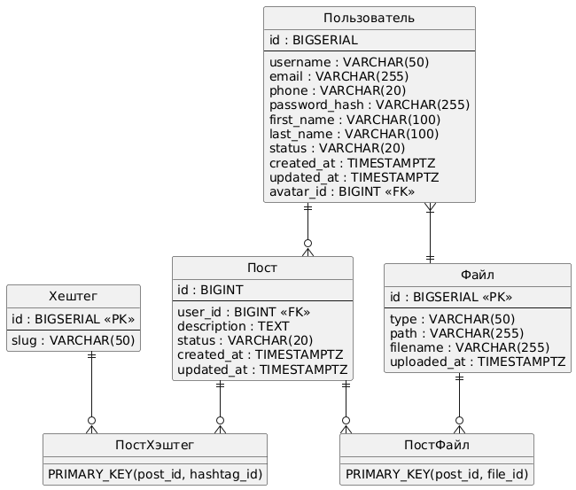

# Лабораторная работа 2
### Выполнил:
* Кузнецов Владимир
* Группа P4150
* Дата выполнения: 20.03.2025
* Наименование дисциплины: Взаимодействие с базами данных

## Текст задания
1.  Из описания предметной области, полученной в ходе выполнения ЛР 1, выделить сущности, их атрибуты и связи, отразить их в инфологической модели (она же концептуальная)
2.  Составить даталогическую (она же ER-диаграмма, она же диаграмма сущность-связь) модель. При описании типов данных для атрибутов должны использоваться типы из СУБД PostgreSQL.
3.  Реализовать даталогическую модель в PostgreSQL. При описании и реализации даталогической модели должны учитываться ограничения целостности, которые характерны для полученной предметной области
4.  Заполнить созданные таблицы тестовыми данными.
## Предметная область
Система управления пользовательским контентом
## Инфологическая модель
  
Сущность "Пользователь":
- ID пользователя (PK)
- Никнейм
- Почта
- Номер телефона
- Хэш пароля
- Имя
- Фамилия
- Статус
- Дата регистрации
- Дата обновления
- ID аватара (FK к Файлу)

Сущность "Пост":
- ID контента (PK)
- ID пользователя (FK к Пользователю)
- Описание поста
- Статус
- Дата создания
- Дата обновления

Сущность "Хештег":
- ID хештега (PK)
- Слаг

Сущность "Файл":
- ID файла (PK)
- Тип
- Путь к файлу
- Имя файла
- Дата загрузки

Связи:
1. Пользователь (1) --- (M) Пост
2. Пост (N) --- (M) Хештег (через ассоциацию "Связь поста и хештега")
3. Пост (N) --- (M) Файл (через ассоциацию "Связь поста и файла")
4. Пользователь (M) --- (1) Файл (как аватар)
### Классификация сущностей
1. Пользователь (User) - стержневая сущность
2. Пост (Post) - стержневая сущность
3. Хештег (Hashtag) - стержневая сущность
4. Файл (File) - стержневая сущность
5. Связь поста и хештега (PostHashtag) - ассоциация
6. Связь поста и файла (PostFile) - ассоциация
## ER-диаграмма

## Даталогическая модель
```sql
CREATE TABLE users (  
    id BIGSERIAL PRIMARY KEY,  
    username VARCHAR(50) NOT NULL UNIQUE,  
    email VARCHAR(255) UNIQUE,  
    phone VARCHAR(20) UNIQUE,  
    password_hash VARCHAR(255) NOT NULL,  
    first_name VARCHAR(100),  
    last_name VARCHAR(100),  
    status VARCHAR(20) NOT NULL CHECK (status IN ('active', 'banned', 'deleted')),  
    created_at TIMESTAMPTZ NOT NULL DEFAULT CURRENT_TIMESTAMP,  
    updated_at TIMESTAMPTZ NOT NULL DEFAULT CURRENT_TIMESTAMP,  
    avatar_id BIGINT  
);  

CREATE TABLE files (  
    id BIGSERIAL PRIMARY KEY,  
    type VARCHAR(50) NOT NULL,  
    path VARCHAR(255) NOT NULL,  
    filename VARCHAR(255) NOT NULL,  
    uploaded_at TIMESTAMPTZ NOT NULL DEFAULT CURRENT_TIMESTAMP  
);  

CREATE TABLE posts (  
    id BIGSERIAL PRIMARY KEY,  
    user_id BIGINT NOT NULL,  
    description TEXT,  
    status VARCHAR(20) NOT NULL CHECK (status IN ('draft', 'published', 'archived')),  
    created_at TIMESTAMPTZ NOT NULL DEFAULT CURRENT_TIMESTAMP,  
    updated_at TIMESTAMPTZ NOT NULL DEFAULT CURRENT_TIMESTAMP  
);  

CREATE TABLE hashtags (  
    id BIGSERIAL PRIMARY KEY,  
    slug VARCHAR(50) NOT NULL UNIQUE  
);  

CREATE TABLE post_hashtags (  
    post_id BIGINT NOT NULL,  
    hashtag_id BIGINT NOT NULL,  
    PRIMARY KEY (post_id, hashtag_id)  
);

CREATE TABLE post_files (  
    post_id BIGINT NOT NULL,  
    file_id BIGINT NOT NULL,  
    PRIMARY KEY (post_id, file_id)  
);  

ALTER TABLE users ADD CONSTRAINT fk_user_avatar  
FOREIGN KEY (avatar_id) REFERENCES files(id)  
ON DELETE SET NULL;  

ALTER TABLE posts ADD CONSTRAINT fk_post_user  
FOREIGN KEY (user_id) REFERENCES users(id)  
ON DELETE CASCADE;  

ALTER TABLE post_hashtags ADD CONSTRAINT fk_post_hashtag_post  
FOREIGN KEY (post_id) REFERENCES posts(id)  
ON DELETE CASCADE;  

ALTER TABLE post_hashtags ADD CONSTRAINT fk_post_hashtag_hashtag  
FOREIGN KEY (hashtag_id) REFERENCES hashtags(id)  
ON DELETE CASCADE;  

ALTER TABLE post_files ADD CONSTRAINT fk_post_file_post  
FOREIGN KEY (post_id) REFERENCES posts(id)  
ON DELETE CASCADE;  

ALTER TABLE post_files ADD CONSTRAINT fk_post_file_file  
FOREIGN KEY (file_id) REFERENCES files(id)  
ON DELETE CASCADE;  
```
## Заполнение тестовыми данными
```sql
INSERT INTO users (username, email, phone, password_hash, first_name, last_name, status, created_at, updated_at)  
VALUES  
    ('ivan_88', 'ivan@example.com', '+79161234567', '5f4dcc3b5aa765d61d8327deb882cf99', 'Иван', 'Петров', 'active', '2023-01-15 10:00:00+03', '2023-01-15 10:00:00+03'),  
    ('anna_smith', 'anna@example.com', '+79031234567', '482c811da5d5b4bc6d497ffa98491e38', 'Анна', 'Смирнова', 'active', '2023-02-20 14:30:00+03', '2023-02-20 14:30:00+03'),  
    ('max_developer', 'max@example.com', NULL, 'b1b3773a05c0ed0176787a4f1574ff00', 'Максим', 'Иванов', 'active', '2023-03-10 09:15:00+03', '2023-03-10 09:15:00+03');  

INSERT INTO files (type, path, filename, uploaded_at)
VALUES
    ('image', '/uploads/avatars', 'ivan_avatar.jpg', '2023-01-15 10:05:00+03'),
    ('image', '/uploads/avatars', 'anna_avatar.png', '2023-02-20 14:35:00+03'),
    ('image', '/uploads/posts', 'sunset.jpg', '2023-03-01 18:00:00+03'),
    ('video', '/uploads/posts', 'tutorial.mp4', '2023-03-05 12:00:00+03'),
    ('image', '/uploads/posts', 'cat_meme.jpg', '2023-03-12 16:45:00+03');

UPDATE users SET avatar_id = 1 WHERE username = 'ivan_88';
UPDATE users SET avatar_id = 2 WHERE username = 'anna_smith';

INSERT INTO hashtags (slug)
VALUES
    ('travel'),
    ('programming'),
    ('food'),
    ('cats'),
    ('photography');

INSERT INTO posts (user_id, description, status, created_at, updated_at)
VALUES (1, 'Красивый закат на море #travel #photography', 'published', '2023-03-01 18:05:00+03',
        '2023-03-01 18:05:00+03'),
    (3, 'Как я решил проблему с SQL-запросом #programming', 'published', '2023-03-10 09:20:00+03',
        '2023-03-10 09:20:00+03');
INSERT INTO posts (user_id, description, status, created_at)
VALUES (2, 'Мой новый рецепт пасты #food', 'published', '2023-03-05 12:10:00+03');
INSERT INTO posts (user_id, description, status)
VALUES (1, 'Смешной котик #cats #photography', 'published');

INSERT INTO post_files (post_id, file_id)
VALUES
    (1, 3),
    (2, 4),
    (4, 5);

INSERT INTO post_hashtags (post_id, hashtag_id)
VALUES
    (1, 1),
    (1, 5),
    (2, 2),
    (3, 3),
    (4, 4),
    (4, 5);
```